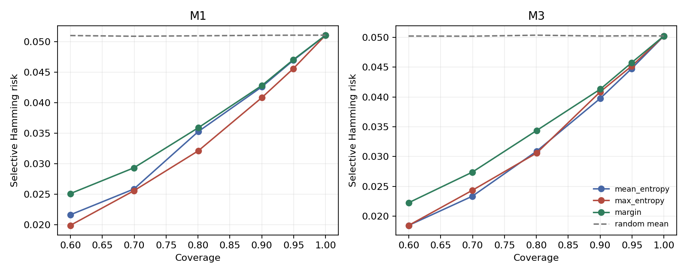
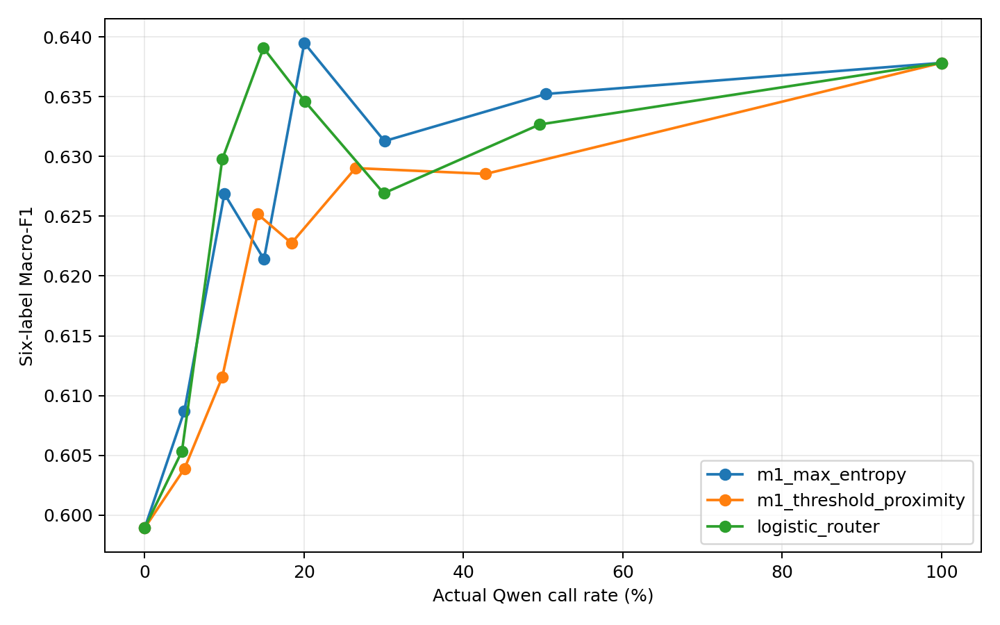

# Stack Overflow C0 Train-OOF 条件路由实验报告（EXP-058–060）

## 技术摘要

EXP-058–060 建立了一条从配对 OOF 预测、校准与选择性预测，到可部署前置路由器的完整开发证据链。三项实验均限定于 `DATA-SO-TASK-V1` 的 3,360 条训练样本，未访问 validation/test。EXP-058 是生成严格 out-of-fold（OOF）预测的训练与 held-out forward 阶段；其后的 EXP-059/060 只消费冻结 OOF 数据，未重开原始文本、未加载模型或执行模型前向。

核心结果是：EXP-060 的 fully nested logistic router 在 nominal 15% Qwen 调用档位选择了 501/3,360 条样本，实际调用率为 14.9107%。与 M1-only 相比，六标签 Macro-F1 从 0.598919 提升至 0.639087（+0.040168），五标签 Macro-F1 提升 +0.006097，Hamming loss 从 0.051042 降至 0.046677（−0.004365）。2,000 次 duplicate-component bootstrap 中，六标签 Macro-F1 增益区间为 [0.009891, 0.071126]，Hamming-loss 差值区间为 [−0.006332, −0.002515]；但五标签增益区间 [−0.007688, 0.019733] 跨 0。因此，当前证据支持“在冻结的 seed-42 train-OOF 模型对上存在可用的 pre-Qwen 路由信号”，不支持独立测试收益、跨 seed 稳定性、其他论坛/模型泛化、实际延迟或成本收益。

最终决策是保留并冻结 EXP-060 router branch，作为开发阶段候选；不再继续调整 feature、router、cutoff 或 operating point。若要形成部署或泛化结论，应另行预注册并使用新数据做独立确认。

| 阶段 | 主要问题 | Verified 结果 | 独立验证 |
| --- | --- | --- | --- |
| EXP-058 | 能否构造无 component leakage、逐行对齐的 M1/M3 train-OOF logits？ | 3,360/3,360 行完整配对；0 个 component 跨 fold；每个模型 20,160 个有限 logits | 26,989/26,989 |
| EXP-059 | 校准、选择性预测和 whole-vector 上限有多大？ | 两个模型均保留 identity calibration；M1/M3 abstention gate 均通过；oracle 显示互补上限 | 4,684/4,684 |
| EXP-060 | 仅用 pre-Qwen 信息能否路由少量样本到 M3？ | Logistic router 在实际 14.9107% 调用率下 Macro-F1 +0.040168、Hamming −0.004365，formal gate 通过 | 4,412/4,412；contract tests 23/23 |

## 1. 研究问题与证据边界

该实验链针对一个受约束的系统问题：M1 RoBERTa 已经运行、M3 Qwen3-4B Classification LoRA 尚未调用时，能否仅凭 M1 侧和低成本文本长度信息，识别值得调用 M3 的少量样本，并用 M3 的完整六标签预测向量替换 M1 的完整六标签预测向量。

路由操作是 whole-vector replacement，不允许逐标签拼接。EXP-059 的 oracle 使用 gold 计算每行哪一个完整向量更好，只用于估计互补上限；EXP-060 的 router 则只能使用部署时在调用 M3 前可获得的信息。

本报告中的证据等级与结论类型如下：

| 结论 | 证据等级 | 结论类型 | 边界 |
| --- | --- | --- | --- |
| EXP-058 生成了完整、component-disjoint 的配对 OOF logits | 强证据（流程与完整性） | 实验事实 | 只证明数据产品完整性，不比较模型性能 |
| EXP-059 的校准、abstention 和 oracle 结果 | 初步证据（开发集） | 实验事实 | fully cross-fitted train-OOF，不是独立 test |
| EXP-060 logistic router 在冻结档位通过 gate | 初步证据（开发集） | 实验事实 | 单一 seed、单一 M1/M3 模型对、train-OOF |
| 当前 router 值得保留但不应继续在同一 OOF 上调参 | 初步证据（开发集） | 助手综合判断，与冻结决策一致 | 下一步需要新数据独立确认 |

## 2. 共享数据与评估合同

- 数据：`DATA-SO-TASK-V1` train split，共 3,360 行。
- 重复结构：3,277 个 duplicate components；同一 component 的全部行必须位于同一 fold。
- 标签顺序：`love, joy, surprise, anger, sadness, fear`。
- 折划分：5 个 component-disjoint folds，每折 672 个 held-out rows、2,688 个 train rows。
- fold assignment seed：20260816；canonical model seed：42。
- `surprise` 在五个 held-out folds 中的正例数为 6/6/6/7/6，总支持度仅 31。
- 全链禁止访问 validation/test；EXP-059/060 禁止 model load、model forward 和 raw-text access。
- 主要分类指标：六标签 Macro-F1、去除 `surprise` 的五标签 Macro-F1、Micro-F1、Hamming loss、subset accuracy。
- 不确定性区间：以 duplicate component 为重采样单元做 2,000 次 bootstrap，seed 20260817。

低支持度的 `surprise` 会显著影响六标签 Macro-F1，因此报告同时给出五标签 Macro-F1。五标签指标不是替代主要指标，而是用于判断整体提升是否只由 `surprise` 驱动。

## 3. EXP-058：配对 M1/M3 OOF logits 基础设施

### 3.1 目的与方法

EXP-058 的任务不是比较 M1 与 M3 的性能，而是生成后续分析可安全消费的逐行配对 raw logits。M1 和 M3 共用同一个冻结 fold manifest；每条训练样本的预测都来自未见过该样本所属 fold 的模型。

| 模型族 | 冻结配置 | 每折训练 | 五折总资源 |
| --- | --- | ---: | ---: |
| M1 | RoBERTa-base | 4 epochs，672 optimizer steps | 5,865.660 秒（1.629 小时），峰值 RSS 5.543 GB |
| M3 | Qwen3-4B BF16 unquantized，rank-8 LoRA/head，112 insertion points，7,355,398 trainable parameters | 2 epochs，5,376 optimizer steps | 41,668.653 秒（11.575 小时），峰值 MLX 8.732 GB |

合计模型 wall time 为 47,534.313 秒（13.204 小时），API 成本为 0 美元。

### 3.2 结果与完整性

- 3,360 条 source-order-preserved paired rows。
- M1 和 M3 各有 20,160 个有限 raw logits（3,360 × 6）。
- component leakage 为 0；18 个 conflicting duplicate components 均保持完整。
- 最大 label allocation error 为 0.02580645。
- paired private artifact SHA-256：`e8d2efde7ca62b3f09519390a6305d09ba0f3ea1dfbecbe8a11dbe4ffd482bfc`。
- ordered sample IDs SHA-256：`c9e4bd1eb2bdbb33c833234754c493b8818aa6c610acaf88659ae74fa94848a3`。
- public fold manifest SHA-256：`82929b1d837ceb9825c5bc39a8fea18f6d0736fca42aad630f3788b1ff8139d8`。

五个 M1 folds 和五个 M3 folds 的 fold-level verification 合计为 505/505；production final verifier 为 26,989/26,989。第一次 final verifier 仅发现五个中间 private fold 目录权限为 0755 而非 0700；修复只涉及目录 mode，未重训、未修改 logits，paired artifact hash 保持不变。

EXP-058 的正确结论是“后续 OOF 分析输入已完整、对齐且无 component leakage”。该阶段没有计算概率、阈值、分类指标、校准、oracle 或 router，不能据此宣称 M1 或 M3 更准确。

## 4. EXP-059：校准、选择性预测与 whole-vector 上限

### 4.1 Fully cross-fitted 分析

EXP-059 只消费冻结的 EXP-058 paired OOF logits。对每个 held-out fold，标量 temperature 和 shared threshold 都只在其余四个 folds 上拟合，再应用到该 held-out fold；五次结果恢复为原 source order。

Temperature scaling 的采用条件是 NLL 至少改善 1e-6，且 Brier score 恶化不超过 1e-6。阈值网格为 0.05–0.95、步长 0.01；tie-break 顺序为 Macro-F1 最高、Hamming loss 最低、距 0.5 最近、较低 threshold。

### 4.2 校准结果

| 模型 | Identity NLL | Temperature NLL | Identity Brier | Temperature Brier | 最终 calibrator |
| --- | ---: | ---: | ---: | ---: | --- |
| M1 | 0.14401450 | 0.14405242 | 0.03866577 | 0.03864055 | identity，T=1.0 |
| M3 | 0.12726263 | 0.12768899 | 0.03551354 | 0.03555488 | identity，T=1.0 |

M1 的 temperature Brier 仅有极小改善，但 NLL 变差；M3 的 NLL 和 Brier 均变差。因此两者都未通过采用 gate，最终参数均为 identity calibration，而不是 full-OOF 辅助拟合得到的约 1.008/1.007。

### 4.3 Cross-fitted 分类结果

| 系统 | 六标签 Macro-F1 | 五标签 Macro-F1 | Micro-F1 | Hamming loss | Subset accuracy |
| --- | ---: | ---: | ---: | ---: | ---: |
| M1 | 0.598919 | **0.718703** | 0.762081 | 0.051042 | **0.761607** |
| M3 | **0.637843** | 0.710509 | **0.765455** | **0.050248** | 0.754762 |

M3 的六标签 Macro-F1 更高，但去除低支持度 `surprise` 后，M1 的五标签 Macro-F1 更高。`surprise` 上 M1 F1=0、M3 F1=0.274510，因此不能将结果概括为“M3 全面优于 M1”。

### 4.4 选择性预测

EXP-059 比较 mean entropy、max entropy 和 threshold margin 三种不确定性排序。在预注册 gate 下，M1 和 M3 都找到通过的 operating point：

| 模型 | 选择方法 | Target / actual coverage | 接受行数 | Hamming risk | 相对 full-risk 降幅 | 五标签 Macro-F1 | Bootstrap 95% 降幅区间 |
| --- | --- | ---: | ---: | ---: | ---: | ---: | --- |
| M1 | max entropy | 90% / 90.0298% | 3,025 | 0.040826 | 20.0135% | 0.720893 | [16.8004%, 23.2356%] |
| M3 | margin | 80% / 80.0595% | 2,690 | 0.034387 | 31.5662% | 0.760239 | [27.7909%, 35.7422%] |

M1 的点估计刚越过 20% gate，但 bootstrap 区间跨越 20%，应表述为边界通过；M3 的区间整体高于 20%，证据更稳定。区间未校正 uncertainty-method selection，且 abstention 表示拒绝输出，不等于预测 neutral 类。

图中显示，按不确定性剔除部分样本可以降低总体风险，但不同方法和模型的收益不同。它证明的是当前 OOF 排序中的 selective-risk 信号，而不是生产部署中的真实拒答收益。

### 4.5 Whole-vector oracle

Oracle 对每条样本比较 M1 和 M3 的完整六标签 Hamming loss；只有当 M3 严格更好时才选择 M3，平局保留 M1。它选择 M3 的样本数为 313/3,360（9.3155%）：

| 系统 | 六标签 Macro-F1 | 五标签 Macro-F1 | Hamming loss | 相对 M1 Macro 增益 | 相对 M1 五标签增益 |
| --- | ---: | ---: | ---: | ---: | ---: |
| Whole-vector oracle | 0.708849 | 0.806174 | 0.033929 | +0.109930 | +0.087472 |

Macro-F1 增益的 bootstrap 95% 区间为 [0.077843, 0.142330]，五标签增益区间为 [0.075072, 0.100581]。这说明 M1/M3 之间存在较强的逐样本互补上限，但 oracle 依赖 gold，不是 learned router，也不可部署。

EXP-059 formal wall time 为 18.723 秒，峰值 RSS 0.144 GB，API 成本为 0；独立 verifier 通过 4,684/4,684 项检查。第一次 verifier attempt 因 public 与独立内部字段映射不一致而在比较前触发 KeyError；正式分析产物未重跑、未改变，修复 verifier 映射后通过。

## 5. EXP-060：Fully nested pre-Qwen router

### 5.1 防泄漏训练结构

EXP-060 在五个 outer folds 上执行 fully nested cross-fitting：

1. 每轮保留一个 outer held-out fold，共 672 行；其余四折共 2,688 行作为 outer router-train。
2. 在这四个 folds 内轮流保留一个 inner fold，用另外三个 folds 重算 M1/M3 thresholds，再为 inner-heldout rows 构造 feature 和 target。
3. 合并四个 inner-heldout parts，得到覆盖全部 outer-train rows 的 nested router-training table。
4. StandardScaler 和 logistic regression 只拟合这 2,688 条 nested outer-train rows。
5. outer-heldout feature 使用全部四个 outer-train folds 上选出的 threshold 构造；router 只在 held-out rows 上应用一次。
6. 五轮得分恢复到原始 source order；policy cutoff 也只由相应 outer-train scores 决定。

五个 outer routers 全部收敛，每折只需 5–6 次迭代。该设计避免用 outer-heldout gold、M3 outcome 或统计量影响 threshold、scaler、router 和 cutoff。

### 5.2 Target、runtime features 与模型

Target 是 whole-vector binary target：若某行 M3 的六标签 Hamming loss 严格小于 M1，则 target=1；否则为 0，平局选择 M1。Gold 和 M3 logits 只用于构造训练 target 和离线评估，不能进入 runtime features。

冻结的 14 个 runtime features 按顺序为：

1. M1 identity probabilities：`love`、`joy`、`surprise`、`anger`、`sadness`、`fear`；
2. M1 mean binary entropy 与 max binary entropy；
3. 相对 nested M1 threshold 的 minimum margin；
4. M1 predicted cardinality；
5. M1 highest probability 与 lowest probability；
6. character length 与 M1 token length。

明确禁止的 runtime feature 包括全部 M3 值、gold/correctness、oracle/disagreement、sample/component/fold IDs、raw text 和 validation/test statistics。

Learned router 是 `StandardScaler` 加 L2 `LogisticRegression`：C=1.0、`class_weight=balanced`、`solver=liblinear`、`max_iter=1000`、`random_state=42`，无超参数搜索。对照策略为 M1 max entropy 和 M1 threshold proximity；另报告 M1-only 与 M3-only 基线。

### 5.3 冻结 gate

候选 operating point 必须同时满足：

- 实际 Qwen call rate ≤20%；
- 六标签 Macro-F1 gain ≥0.01；
- 五标签 Macro-F1 gain ≥−0.005；
- Hamming loss 不得恶化；
- 至少一个非 `surprise` 标签的 F1 gain ≥0.005。

Call-rate grid 为 0/5/10/15/20/30/50/100%。cutoff 由 outer-router-train score 按 `ceil(rate × n_train)` 得到；held-out cutoff ties 全部 route，因此实际调用率可以偏离 nominal rate。

### 5.4 候选 operating points

M1-only baseline 为 Macro-F1 0.598919、五标签 Macro-F1 0.718703、Micro-F1 0.762081、Hamming loss 0.051042、subset accuracy 0.761607。

| Policy | Nominal / actual call rate | Qwen rows | Macro-F1 | Macro gain | 五标签 gain | Hamming loss | Hamming delta | Gate |
| --- | ---: | ---: | ---: | ---: | ---: | ---: | ---: | --- |
| M1 max entropy | 10% / 10.0000% | 336 | 0.626890 | +0.027972 | −0.000720 | 0.047421 | −0.003621 | Pass |
| M1 threshold proximity | 15% / 14.1667% | 476 | 0.625191 | +0.026272 | −0.000906 | 0.049603 | −0.001438 | Pass |
| **Logistic router** | **15% / 14.9107%** | **501** | **0.639087** | **+0.040168** | **+0.006097** | **0.046677** | **−0.004365** | **Pass / selected** |

Selected logistic policy 的 Micro-F1 为 0.774503，subset accuracy 为 0.779762，相当于每 1,000 条输入约调用 149.1 次 Qwen。

曲线显示 policy 收益并不随 Qwen 调用率单调增加；selected operating point 位于实际 14.91% 附近。因此结果不支持“调用越多越好”，也不应在同一 OOF 证据上继续搜索更优档位。

在 nominal 15% 档位，最佳 heuristic 是 threshold proximity，实际调用率 14.1667%。Logistic 相对该 heuristic 的 Macro-F1 为 +0.013896、五标签 Macro-F1 为 +0.007002、Hamming loss 为 −0.002927。该比较匹配的是 nominal rate，不是严格相同的 actual routed-row count。

### 5.5 标签级结果与 router discrimination

| 标签 | M1 F1 | Logistic-router F1 | 差值 |
| --- | ---: | ---: | ---: |
| love | 0.841758 | 0.843030 | +0.001271 |
| joy | 0.590778 | 0.602917 | +0.012139 |
| surprise | 0.000000 | 0.210526 | +0.210526 |
| anger | 0.786415 | 0.807541 | +0.021126 |
| sadness | 0.683386 | 0.673540 | −0.009846 |
| fear | 0.691176 | 0.696970 | +0.005793 |

最大非-`surprise` F1 gain 为 anger 的 +0.021126，说明 formal gate 并非只依赖 `surprise`。但 sadness 有所下降，且五标签 bootstrap 区间仍跨 0，不能宣称所有常见标签均稳健改善。

Router target 有 313 个 positives，prevalence 为 9.3155%。整体 PR-AUC 为 0.318653，ROC-AUC 为 0.850804；五折 PR-AUC 范围约 0.266–0.418，ROC-AUC 范围约 0.833–0.867。在诊断阈值 0.5 下，TP/FP/TN/FN 为 239/645/2402/74，precision 0.270362、recall 0.763578。该阈值会预测 884 个 positive，与 selected call-rate cutoff 最终路由的 501 行不是同一概念。

### 5.6 Bootstrap 与 random-routing 对照

| Policy | Actual call-rate 95% CI | Macro gain 95% CI | 五标签 gain 95% CI | Hamming delta 95% CI |
| --- | --- | --- | --- | --- |
| M1 max entropy | — | [−0.001717, 0.058494] | [−0.014565, 0.012370] | [−0.005211, −0.002038] |
| M1 threshold proximity | — | [−0.002910, 0.057080] | [−0.016378, 0.014373] | [−0.003135, 0.000347] |
| **Logistic router** | **[13.6673%, 16.2172%]** | **[0.009891, 0.071126]** | **[−0.007688, 0.019733]** | **[−0.006332, −0.002515]** |

Logistic 的 Macro gain 区间全为正，但下界略低于预注册 +0.01 gate；formal gate 按冻结规则由点估计决定。Hamming delta 区间全为负，表明错误位数下降在当前 OOF bootstrap 中更稳定。五标签区间跨 0，是最重要的不确定性限定。所有区间均未校正 operating-point 或 policy selection。

100 次 deterministic、component-aware random routing 在 nominal 15% 下给出 Macro-F1 mean/p95=0.608631/0.626707；logistic 的 0.639087 高于 p95。Random Hamming mean/p05=0.050923/0.050196，logistic 的 0.046677 更低。五标签 random mean/p95=0.717764/0.724803，而 logistic 为 0.724799，略低于 p95 约 0.000003，因此五标签优势同样不能表述为对随机路由的稳健胜出。

### 5.7 Routed risk/retention 诊断

在 selected logistic policy 上，100% coverage 的 Hamming risk 为 0.046677、subset error 为 0.220238。nominal 90% coverage 时，三种不确定性排序均降低总体风险；例如 max entropy 实际保留 90.0298% 样本，Hamming risk 为 0.037410、subset error 为 0.178843。

但 positive retention 在标签间并不均衡。例如同一 90% coverage 下，mean entropy 对 `fear` 仅保留 21/74 个 positives（28.38%），而 max entropy 为 58.11%、margin 为 68.92%。因此 risk-coverage 只能作为诊断，不能仅凭整体风险曲线推断各标签都得到公平保留。

EXP-060 formal wall time 为 28.157 秒，峰值 RSS 0.200 GB；模型前向次数、API 与 GPU 成本均为 0。独立 verifier 未导入 runner，重新计算 nested thresholds、scalers、routers、public/private aggregates 和 figures，最终通过 4,412/4,412 项检查；专项 contract tests 为 23/23。

## 6. 三阶段证据链如何衔接

| 输入阶段 | 产生的可复用证据 | 下一阶段如何消费 | 明确禁止的捷径 |
| --- | --- | --- | --- |
| EXP-058 | 同 folds、同 source order 的 M1/M3 raw OOF logits，以及预计算长度 | EXP-059/060 在冻结 OOF 上派生概率、threshold、target | 重新读取 raw text、重跑 tokenizer、访问 validation/test |
| EXP-059 | Identity calibration、cross-fitted thresholds、选择性风险、whole-vector oracle 上限 | Oracle 只用于决定是否值得预注册 router；不作为 EXP-060 target array 直接输入 | 把 oracle 当部署 policy；复用不符合 EXP-060 nesting 的 fold thresholds |
| EXP-060 | Fully nested router scores、train-only cutoffs、三种 deployable policies | 形成 seed-42 train-OOF development candidate | 用 outer-heldout outcome 调 threshold/scaler/router/cutoff；继续在同一 OOF 上调参 |

这个衔接很关键：EXP-059 的 oracle 证明“存在可利用互补性”，但只有 EXP-060 的 fully nested 设计才能估计 learned pre-Qwen router 在当前开发样本上的表现。

## 7. 完整性、隐私与可复现性

| 阶段 | Final status | Checks | 数据访问边界 | 主要独立复算 |
| --- | --- | ---: | --- | --- |
| EXP-058 | Verified | 26,989/26,989 | train-only；无 validation/test | fold tables、paired alignment、hashes、permissions |
| EXP-059 | Verified Pass | 4,684/4,684 | 只读 paired train-OOF；无 model load/forward | calibration、thresholds、metrics、rankings、random、oracle、bootstrap |
| EXP-060 | Verified Pass | 4,412/4,412 | 只读 paired train-OOF；无 raw text、validation/test、model load/forward | nested thresholds、features、scalers、routers、cutoffs、aggregates、figures |

三个实验的 `run.json` 均保留 `CompletedAwaitingVerification`，因为 formal runner 先以 append-only 方式完成产物，之后 verifier 再写入最终验证文件。最终证据状态应以各自 `verification.json.status=Passed` 和 evidence log 的 `Verified Pass` 为准，而不是误读为尚未验证。

公开科学结果以 aggregate metrics、折级摘要、图和 hash-bound provenance 为主；EXP-058 另公开匿名化的 `sample-*`/`component-*` fold-manifest 元数据，但不含 gold、文本、logits 或 probabilities。EXP-058 paired logits 以及 EXP-059/060 的 row-level outcome arrays 保存在受权限保护且被 Git 忽略的 private 路径中。

## 8. 可支持与不可支持的结论

### 当前证据支持

- EXP-058 建立了完整、component-disjoint、source-order-preserved 的 M1/M3 train-OOF 数据产品。
- 两个模型在当前 OOF 上都没有通过 temperature-scaling 采用 gate，identity calibration 是冻结选择。
- M1/M3 都存在可用的不确定性排序信号；M3 的 selected abstention evidence 更强，M1 为边界通过。
- Gold-based whole-vector oracle 显示显著互补上限，因此预注册 learned router 是合理的下一步。
- Fully nested logistic router 在冻结的 nominal 15% 档位通过全部 development gates，并在六标签 Macro-F1 和 Hamming loss 上优于 M1-only、best nominal-rate heuristic 及 matched-count random comparator。
- 简单 heuristic policies 也通过 gate，因此 learned router 有额外价值，但不是唯一可行方案。

### 当前证据不支持

- 独立 test-set 或真实部署收益。
- 跨 seed、跨数据集、跨论坛、跨模型版本的稳定性。
- 真实 Qwen latency、吞吐、能耗或货币成本收益；本实验没有执行模型前向。
- 五标签 Macro-F1 的稳健正增益；其 bootstrap 区间跨 0。
- 所有标签都改善，或 selective retention 对各标签均衡。
- 任何关于情绪机制、因果机制或模型“理解情绪”的结论。

## 9. 决策与后续动作

EXP-058–060 已完成其开发阶段目标。EXP-060 logistic router 应作为 frozen development candidate 保留，但不应继续在同一 OOF 证据上调整 feature、router、cutoff 或 operating point。继续优化会把当前估计进一步用于选择，增加乐观偏差。

后续只有两条合理路径：

1. 系统演示或论文证据归档：如实展示当前 seed-42 train-OOF 结果及限定，不扩大 claim。
2. 另行预注册新数据独立确认：冻结现有 pipeline 和 selected 15% operating point，在未参与选择的新数据上验证 Macro-F1、五标签 Macro-F1、Hamming loss、实际 call rate、label retention，以及真实 latency/cost。

## 10. 可追溯证据入口

### EXP-058

- [Protocol：Paired M1/M3 OOF](experiments/stack-overflow-emotion-gold/protocols/exp-058-paired-m1-m3-oof.md)
- [Production REPORT](experiments/stack-overflow-emotion-gold/oof-router/runs/exp-058-paired-oof-production/REPORT.md)
- [Production VERIFICATION-SUMMARY](experiments/stack-overflow-emotion-gold/oof-router/runs/exp-058-paired-oof-production/VERIFICATION-SUMMARY.md)
- [Fold-manifest preflight VERIFICATION-SUMMARY](experiments/stack-overflow-emotion-gold/oof-router/runs/exp-058-fold-manifest-preflight-attempt-2/VERIFICATION-SUMMARY.md)

### EXP-059

- [Protocol：Calibration and selective prediction](experiments/stack-overflow-emotion-gold/protocols/exp-059-calibration-selective-prediction.md)
- [Formal REPORT](experiments/stack-overflow-emotion-gold/oof-router/runs/exp-059-calibration-selective-prediction/REPORT.md)
- [VERIFICATION-SUMMARY](experiments/stack-overflow-emotion-gold/oof-router/runs/exp-059-calibration-selective-prediction/VERIFICATION-SUMMARY.md)

### EXP-060

- [Protocol：Pre-Qwen deployable router](experiments/stack-overflow-emotion-gold/protocols/exp-060-pre-qwen-deployable-router.md)
- [Formal REPORT](experiments/stack-overflow-emotion-gold/oof-router/runs/exp-060-pre-qwen-router/REPORT.md)
- [VERIFICATION-SUMMARY](experiments/stack-overflow-emotion-gold/oof-router/runs/exp-060-pre-qwen-router/VERIFICATION-SUMMARY.md)
- [Selected operating point](experiments/stack-overflow-emotion-gold/oof-router/runs/exp-060-pre-qwen-router/selected-operating-point.json)
